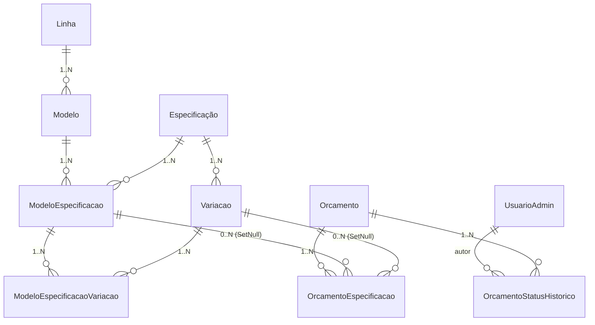

# Arquitetura — Sistema SM Unitur

Visão de alto nível para quem precisa entender ou modificar o sistema.

---

## Stack

```
┌──────────────────────────────────────────────────────────────┐
│                    Navegador do cliente                       │
└──────────────────────────────────────────────────────────────┘
                            │ HTTPS
                            ▼
┌──────────────────────────────────────────────────────────────┐
│  Nginx (porta 443)                                            │
│  - termina TLS (Let's Encrypt)                                │
│  - / → Next.js SSR                                            │
│  - /api/* → backend Express                                   │
│  - /uploads/* → backend Express (poderia ser cache local)     │
└─────────────────┬─────────────────────────────┬───────────────┘
                  │                             │
                  ▼                             ▼
        ┌─────────────────┐           ┌──────────────────┐
        │ Next.js (3000)  │           │ Express (3001)   │
        │ - Landing       │  ─ HTTP ─▶│ - REST API       │
        │ - Admin (CSR)   │           │ - Multer uploads │
        │ - SSR pages     │           │ - JWT auth       │
        └─────────────────┘           └────────┬─────────┘
                                               │
                                               ▼
                                      ┌──────────────────┐
                                      │ Prisma ORM       │
                                      │ ↓                │
                                      │ MySQL 8 (3306)   │
                                      └──────────────────┘

                                      Disk: /var/smunitur/uploads/
                                      (montado em backend/uploads)
```

> **Produção × Desenvolvimento.** O diagrama acima é a **produção** (nativa: Nginx +
> PM2 + MySQL na VM Ubuntu — ver [`docs/2-deploy-oracle.md`](docs/2-deploy-oracle.md)). Em
> **desenvolvimento**, os três serviços (MySQL 8, backend e frontend) sobem em
> containers via `docker-compose.yml`, com hot reload e migrations aplicadas no
> boot — ver [`docs/DOCKER.md`](docs/DOCKER.md). O código é idêntico; muda apenas
> a forma de empacotar e executar.

---

## Frontend (Next.js 16, App Router)

```
frontend/src/
├── app/
│   ├── page.tsx               → Landing (server component)
│   ├── layout.tsx             → root layout + global styles
│   └── admin/
│       ├── layout.tsx         → wrapper protegido (Sidebar)
│       ├── login/page.tsx
│       ├── dashboard/page.tsx
│       ├── orcamentos/page.tsx
│       ├── producao/page.tsx
│       ├── modelos/page.tsx
│       ├── linhas/page.tsx
│       ├── especificações/page.tsx
│       ├── usuarios/page.tsx
│       └── perfil/page.tsx
├── components/
│   ├── admin/
│   │   ├── Sidebar.tsx        → nav + perfil + logout
│   │   └── ConfirmModal.tsx
│   └── landing/
│       ├── Hero.tsx           Header, Sobre, FAQ, Footer,
│       ├── Modelos.tsx       Acompanhamento, Contato,
│       ├── FormularioOrcamento.tsx  Servicos, Reveal (anim wrapper)
│       └── ...
└── lib/
    ├── api.ts                 → axios + interceptors + API_BASE
    ├── orcamentoStatus.ts     → fonte única de status (label, cor)
    ├── slug.ts                → gerarSlug compartilhado
    └── whatsapp.ts            → monta link wa.me com mensagem pronta
```

**Convenções**:

- Páginas admin: **client components** (`'use client'`) que falam direto com a API via `axios` + token JWT no `localStorage`. Não usam SSR.
- Landing: mistura — `page.tsx` server, componentes individuais `'use client'` quando precisam de interatividade.
- Estilo: Tailwind v4 + estilos inline para cores específicas da identidade visual (azul `#005ED5`, laranja `#FF9400`).

---

## Backend (Express + Prisma)

```
backend/src/
├── index.ts            → bootstrap (carrega env, monta middlewares e rotas)
├── middleware/
│   └── auth.ts         → authMiddleware + requireNivel + tokenVersion check
├── routes/
│   ├── auth.ts         → login, /me, foto perfil, change-password
│   ├── orcamentos.ts   → POST público, GET acompanhar, CRUD admin
│   ├── producao.ts     → lista esteira + histórico (status via /orcamentos)
│   ├── modelos.ts     → CRUD + gestão de especificações por modelo
│   ├── linhas.ts   → CRUD
│   ├── especificações.ts    → biblioteca global de especificações e variações
│   └── admin.ts        → dashboard + CRUD de usuários
└── utils/
    ├── env.ts          → valida e expõe variáveis de ambiente
    ├── logger.ts       → pino (JSON em prod, pretty em dev)
    ├── prisma.ts       → cliente singleton + shutdown gracioso
    └── upload.ts       → multer + magic bytes + sharp + apagarUpload
```

---

## Modelo de dados (Prisma)



**Decisões importantes**:

- **Especificações globais reutilizáveis**: "Tipo de Gola" é cadastrado uma vez e associado a Camiseta Polo, Camiseta Básica etc. Cada modelo escolhe **quais variações** daquele especificação expõe ao cliente (via `ModeloEspecificacaoVariacao`).
- **`OrcamentoEspecificacao` com FKs em `SetNull`**: se uma variação for excluída no futuro, o orçamento antigo perde a referência mas o registro permanece — auditoria preservada. Use o campo `valorLivre` como snapshot textual quando precisar dessa garantia.
- **Sem entidade Cliente**: nome/e-mail/telefone são copiados em cada orçamento. Trade-off conhecido — virou item para uma próxima versão (ver [`docs/4-roadmap.md`](docs/4-roadmap.md)).
- **`Orcamento.numero`**: começa em 100, auto-incrementado pela aplicação (não pelo banco), para gerar IDs amigáveis ao cliente.
- **`Orcamento.tamanhos`** e **`Orcamento.cores`**: strings concatenadas (`"PP: 5, P: 10"`). O frontend já estrutura no momento da entrada — normalizar isso virou item para uma próxima versão.
- **`UsuarioAdmin.tokenVersion`**: incrementa em troca de senha, desativação, ou reset administrativo. O middleware compara com o `tv` do JWT — token desatualizado = 401. Substitui a necessidade de uma blacklist de tokens.

---

## Fluxo: cliente envia orçamento

```
1. Cliente abre /  →  Hero, Modelos, Formulário, Contato, FAQ
2. Clica "Solicitar orçamento" → FormularioOrcamento (3 etapas)
   Etapa 1 — Modelo:    GET /api/linhas (apenas ativas com modelos)
                         GET /api/modelos?linha=ID
                         GET /api/modelos/:id/especificações
   Etapa 2 — Detalhes:   tamanhos (matriz local), cores, imagens
   Etapa 3 — Dados:      nome, email, telefone, CPF/CNPJ opcional
3. Submit:               POST /api/orcamentos  (multipart/form-data)
                         → validação: nome, email, qtd >= 1
                         → magic bytes nas imagens
                         → resize via sharp (max 2000px)
                         → cria Orcamento + OrcamentoEspecificacao[] +
                           OrcamentoStatusHistorico("recebido")
4. Resposta:             retorna `{orcamento: {numero, ...}}`
5. Front gera:           link wa.me/NUMERO?text=mensagem_codificada
                         abre em nova aba → cliente confirma no WhatsApp
6. Acompanhamento:       cliente entra em /#acompanhar
                         GET /api/orcamentos/acompanhar/:numero (público)
                         → vê status atual + linha do tempo
```

---

## Fluxo: admin atualiza status

```
1. POST /api/auth/login  → JWT (válido 7 dias, com `tv`)
2. GET /api/admin/dashboard → stats + gráfico mensal
3. GET /api/orcamentos?status=em_producao&pagina=1
4. Modal de detalhe:
   - PATCH /api/orcamentos/:id/valor   (define R$)
   - PATCH /api/orcamentos/:id/status  (transição + obs + histórico)
5. Cliente acompanha via /#acompanhar/:numero  (status atualizado refletido)
```

**Nota**: a aba `/admin/producao` consome a MESMA rota de status — não há `/api/producao/:id/status` separada (foi removida nesta versão por ser duplicada).

---

## Autenticação e autorização

```
Login (POST /api/auth/login)
  └─→ bcrypt.compare (sempre roda, mesmo se usuário não existe — defesa de timing)
  └─→ JWT assinado com HS256:
       { id, email, nivel, tv }    expira em JWT_EXPIRES_IN

authMiddleware (qualquer rota protegida)
  └─→ valida Bearer token
  └─→ busca usuário no DB: confere ativo + tokenVersion
  └─→ injeta req.admin

requireNivel(['super_admin'])
  └─→ 403 se nível do token não estiver na lista
```

**Níveis**:
- `super_admin` — full access (CRUD usuários, redefinir senhas)
- `admin` — gerencia conteúdo (linhas, especificações, modelos, lê usuários)
- `operador` — apenas orçamentos e produção

---

## Operação (produção)

| Recurso | Onde fica | Quem cuida |
|---------|-----------|------------|
| Código | `/var/www/smunitur` (git) | `git pull` + restart PM2 |
| Banco MySQL | local na VM | backup diário em `/var/backups/smunitur` |
| Uploads | `/var/smunitur/uploads` (fora do código) | sobrevive a deploys |
| Logs API | `~/.pm2/logs/smunitur-api-*.log` | logrotate via `pm2-logrotate` |
| Logs Nginx | `/var/log/nginx/` | logrotate padrão |
| SSL | `/etc/letsencrypt/` | renova via `certbot.timer` |

Ver [`docs/2-deploy-oracle.md`](docs/2-deploy-oracle.md) para procedimento completo.

---

## O que NÃO está implementado (intencional)

Decisões registradas em [`docs/4-roadmap.md`](docs/4-roadmap.md):

- Cliente como entidade própria (sem deduplicação)
- Prazo de entrega no orçamento
- Etapas granulares de produção (corte/costura/acabamento)
- Notificação automática por e-mail/WhatsApp ao mudar status
- FK forte de modelo/linha no orçamento
- Anexar "layout final" para o cliente visualizar

A versão atual foca em estabilidade, segurança e operação. Features de negócio adicionais entram em branches separadas após o lançamento e validação com o cliente real.
